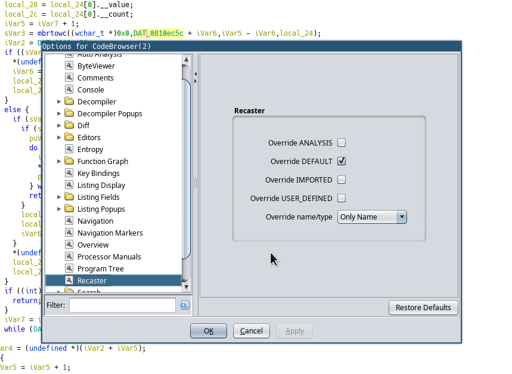
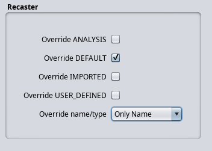

# Recaster (Ghidra plugin)

## Description

The plugin search dependencies of the variable/parameter and change their names and/or types. See animation below.

> Fig. 1. Example of using the plugin

## Instruction

1. Find the target: argument of the function.
1. Choose, what you want to change:
    - a variable's name/type ("Recast variable backward") or
    - a parameter of the function ("Recast variable forward").
1. In the context menu click a needed item.

In Tool Options (see Fig. 2) you can change options of the plugin ("Recaster" item):
- source type, which can be overrides;
- name or/and datatype will be changed.

> Fig. 2. Options of Recaster plugin
